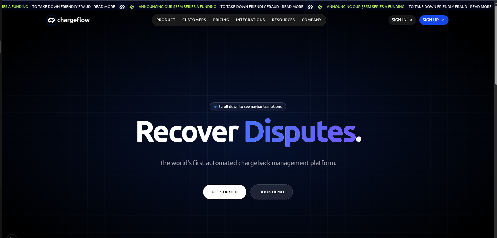
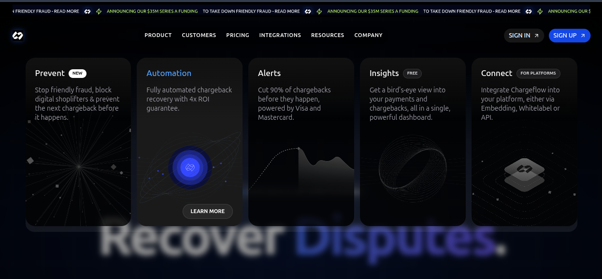
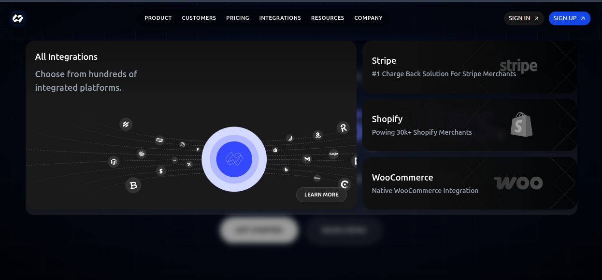
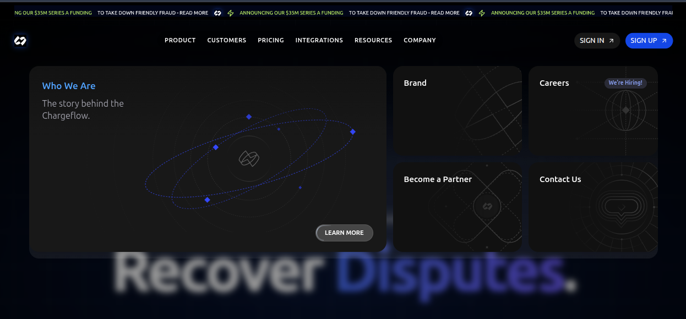
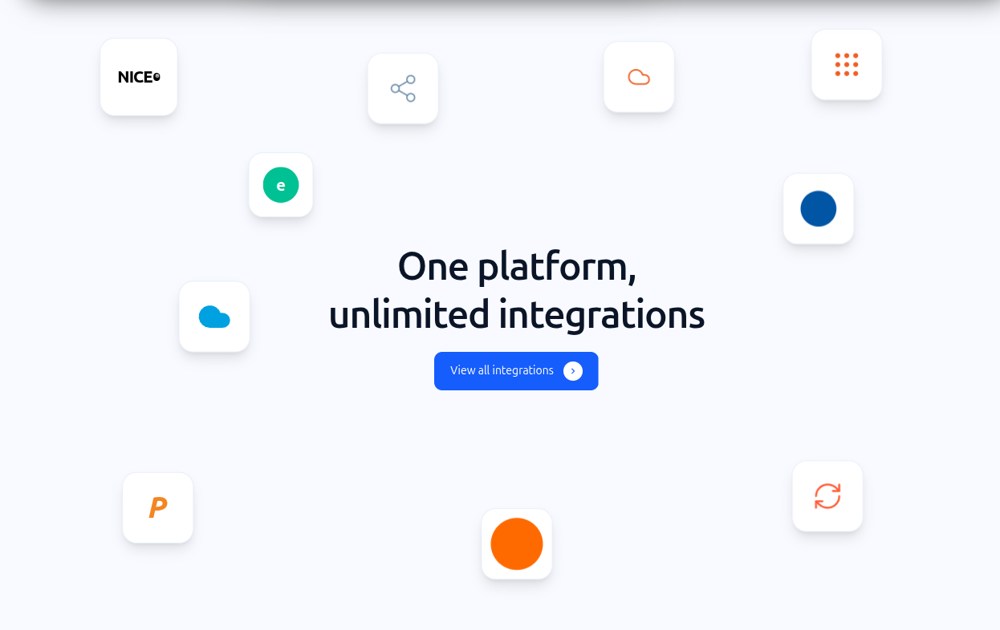
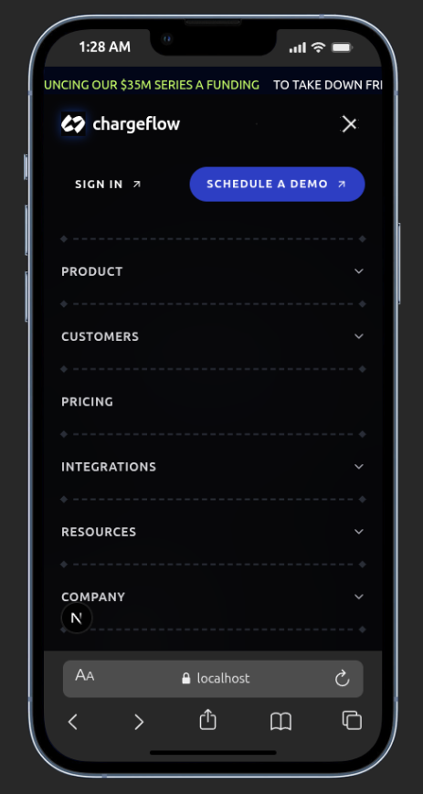

# Omnistra Frontend Technical Assessment

This project is a high-fidelity replica of specific sections of the [Chargeflow](https://chargeflow.io) and [domu.ai](https://domu.ai/#integrations) website, built as a technical assessment for Omnistra. It focuses on pixel-perfect responsive design, complex layout structures, and smooth, performant animations.

### 🔗 Live Preview
[View Live Deployment Here](https://frontend-technical-assessment-omnis.vercel.app/)

---

## 🛠️ Tech Stack & Implementation Details

- **Framework:** Next.js 16 (App Router)
- **Styling:** Tailwind CSS
- **Animations:** Motion (formerly Framer Motion) for scroll-linked animations and layout transitions
- **Icons:** Lucide React
- **Language:** TypeScript

---

## 🚀 Getting Started

### Prerequisites

You need `pnpm` installed on your machine to run this project. If you don't have it, install it via npm:
```bash
npm install -g pnpm
```

### Installation

1. **Clone the repository:**
   ```bash
   git clone https://github.com/morz-mamun/frontend_technical_assessment_omnistra.git
   cd frontend_technical_assessment_omnistra
   ```

2. **Install dependencies:**
   ```bash
   pnpm install
   ```

### Running the Application

**Local Development Server** (with hot-reloading)
```bash
pnpm run dev
```
*The app will be available at `http://localhost:3000`*

**Production Build** (to test optimized performance)
```bash
pnpm run build
pnpm run start
```

---

## 🧠 Approach and Assumptions Made

### 1. The Navbar & Dropdown System
The original Chargeflow navbar is highly complex, featuring a blurred backdrop header and five distinct mega-menus containing various media types and layouts.
- **Assumption:** Building isolated, modular components for each dropdown (`ProductDropdown`, `CustomersDropdown`, etc.) would make the code immensely cleaner than a massive switch statement inside the nav.
- **Implementation:** Built a responsive wrapper that spans `1142px` wide on desktop, but elegantly handles overflow using horizontal scrolling (`overflow-x-auto`) on tablet sizes (`md`), ensuring cards don't shrink unreadably before snapping to the mobile menu.

### 2. The Integrations Section (Scroll Animation)
The assignment required a 1:1 replica of the scroll-based animation where integration icons fly into the center and snap into a blue Zap icon.
- **Assumption:** Using generic CSS transitions tied to standard scroll events would be jittery. It required a physics-based spring animation mapped directly to viewport scroll progress.
- **Implementation:** Used `motion/react` `useScroll` combined with `useSpring` and `useTransform`. 
- **Performance consideration:** The entire section is fixed to `100vh` inside a `200vh` container. Instead of moving the DOM elements directly, I am animating their `scale`, `opacity`, `x`, and `y` transform values. This ensures the browser handles the animation on the GPU thread, preventing layout thrashing and maintaining a smooth 60fps even on lower-end devices.

### 3. Responsive Adjustments
- **Assumption:** The target breakpoints were primarily Desktop (1024px+), Tablet (768px-1024px), and Mobile (<768px). 
- **Implementation:** On the integrations section, nodes were structurally scaled down by ~45% via a `useIsMobile` hook ensuring the layout didn't spill over the edges on small mobile screens. For the hero section, Tailwind's inline inline style masks were used to ensure the grid backgrounds rendered crisply against the black background across all screen sizes.

---

## 📸 Screenshots

### Navbar


### Mega Menu - Products


### Mega Menu - Integrations


### Mega Menu - Company


### Integrations Section


### Mobile View


